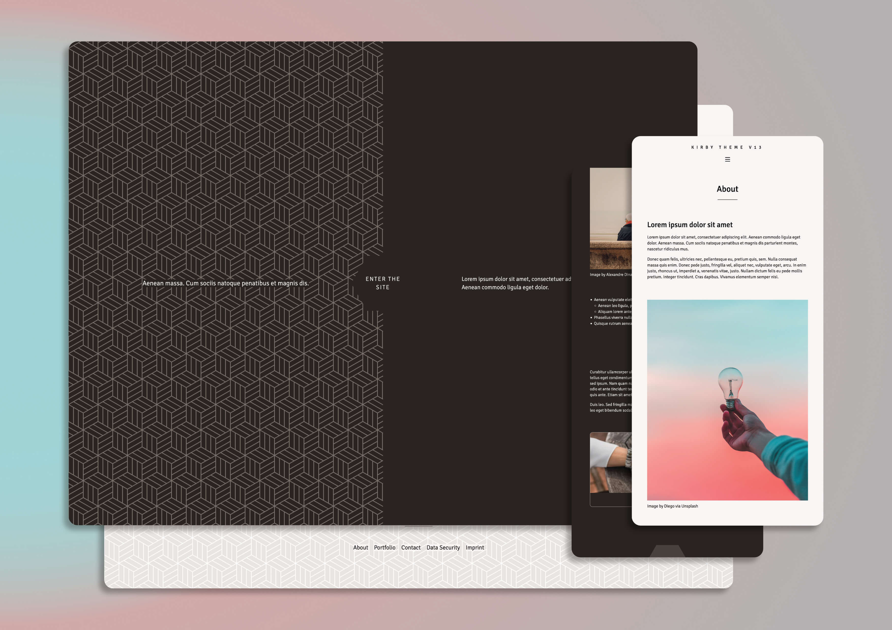

# Kirby theme for "Hendrik Berends v13"

This is the theme for the 13th version of my personal website [hendrik-berends.de](https://hendrik-berends.de).

## Important notes

This theme does not work out of the box and is basically a repository for front end only. It is intended to be used with a Kirby plainkit as well as my own plugin `hb-commons`:

- [kirby](https://github.com/getkirby/plainkit)
- [hb-commons](https://github.com/HENNIROCKS)

Also note that the styles are built in SCSS and thus need compiling by installing [Sass](https://www.npmjs.com/package/sass). Check out `package.json` for all required dependencies and available commands.

Make sure that the theme follows available structures from `hb-commons` and use the [BEM](https://getbem.com) method. Always build the theme on the basis of the "commons" parent plugin.

### Configuring Kirby

Configuring Kirby works outside this or the `hb-commons` plugins, add a [config](https://getkirby.com/docs/guide/configuration) file at the root.

### Disabling a theme

Have only one theme active at a time! Deactivate other themes by renaming their respective folders, e.g. `hb-theme123` to `_hb-theme123`.

## Support Kirby

Please note that publicly running a Kirby website requires a [license](https://getkirby.com/buy).
